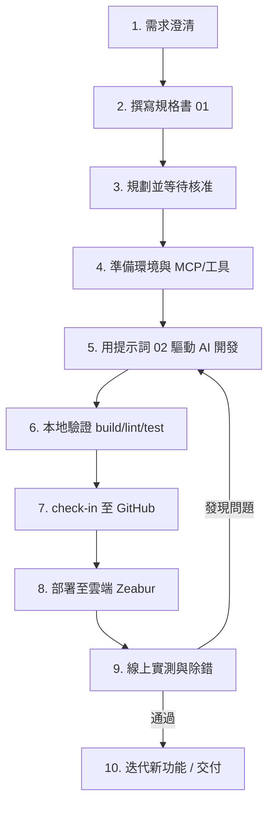

# 網站開發標準流程（可複製範本）

> 本文件把「從零開發一個資料型分析網站」的流程抽象成一套**可重複套用的 SOP**。
> 任何新網站都能照這份流程跑一遍：先寫規格 → 給 AI 提示詞 → 開發 → check-in → 部署 → 迭代。
> 配套文件：`01-規格書範本.md`（規格）、`02-AI提示詞範本.md`（提示詞）。

---

## 〇、整體流程總覽



**鐵則**：每一輪只做「一個可驗證的小增量」，做完一定要 build → push → deploy → 線上驗證，再進下一輪。不要累積大量未驗證的變更。

---

## 一、需求澄清（先問，不要猜）

開工前用多選題向使用者確認**會大幅影響架構**的決策，一次問一題。常見必問項：

| 主題 | 範例問題 | 為何重要 |
|---|---|---|
| 前端技術 | Streamlit（快）還是 HTML/JS（靈活專業）？ | 決定整個前端架構與工時 |
| 分析對象 | 多目標批次 vs 單一目標深度？ | 決定資料模型與頁面導向 |
| 對標產品 | 要參考哪個知名網站的模式？（如 FinLab） | 決定資訊架構與功能範圍 |
| 保留功能 | 既有的爬蟲 / 通知 / ML 要保留嗎？ | 決定移植範圍 |
| 程式碼基底 | 新建 repo 還是沿用現有目錄？ | 決定 git 策略 |
| 雲端帳號 | 是否已有部署平台帳號？ | 決定部署路徑 |

> 產出：把答案回填到 `01-規格書範本.md` 的「決策紀錄」一節。

---

## 二、撰寫規格書

用 `01-規格書範本.md` 由下而上撰寫：

1. **逐個程式 / 模組**介紹功能（最底層）。
2. 往上組合成**子系統**（爬蟲層、分析層、API 層、前端層）。
3. 再往上描述**整體系統功能**與使用者流程。
4. 最後寫**重構 / 新版目標**與**非功能需求**（效能、快取、RWD、可及性）。

> 規格書要能讓「沒看過原始碼的人」也能理解系統在做什麼。

---

## 三、規劃並等待核准

- 先輸出**任務拆解 + 里程碑 + 風險**，明確列出「過程中需要安裝哪些 MCP / 工具」。
- **等使用者核准後**再動工（除非使用者授權自主迭代）。
- 用 SQL `todos` 表追蹤任務狀態（pending / in_progress / done / blocked）。

---

## 四、環境與 MCP / 工具準備

開發資料型網站常需以下工具，**在規劃階段就一併提出**：

| 用途 | 工具 / MCP | 說明 |
|---|---|---|
| 版本控制 check-in | `git` CL/ GitHub MCP | 建 repo、commit、push、開 PR |
| 部署雲端 | Zeabur CLI（`npx zeabur`）| 一鍵部署、查 deployment / log |
| 瀏覽器自動化（登入/設定/除錯） | Chrome / Playwright MCP（browser canvas）| OAuth 設定、線上實測、抓 console error |
| 設計 / UIUX | 設計類 skill（如 impeccable）| token、版面、動效、可及性審查 |
| 資料來源 | 各 API SDK（FinMind、TWSE…）| 視題目而定 |

> 安裝 MCP：用 agentfinder 之類的探索工具搜尋、安裝對應 server。

---

## 五、用提示詞驅動 AI 開發

把 `02-AI提示詞範本.md` 的系統提示詞 + 任務提示詞貼給 AI。要點：

- 一律「先讀既有設計系統/元件，再動手」，不要重造輪子。
- 全站文案語系依使用者設定（本專案為**繁體中文**）。
- 每個增量都要小、可驗證、可回滾。

---

## 六、本地驗證

| 類型 | 指令（本專案範例）|
|---|---|
| 前端建置 | `cd frontend; npm run build` |
| 後端匯入檢查 | `cd backend; python -c "from app.main import app; print('OK')"` |
| Lint / Test | 只跑專案既有的，不新增工具 |

> build 不過就不要 commit。

---

## 七、check-in 至 GitHub

```bash
cd <repo-root>
git add -A
git commit -m "feat(scope): 一句話描述增量

- 變更重點 1
- 變更重點 2

Co-authored-by: Copilot App <223556219+Copilot@users.noreply.github.com>"
git push origin master
```

> 注意：PowerShell 下 git 會把進度寫到 stderr（顯示成紅字 + exit 1），**但 push 其實成功**，看最後一行有 `xxx..yyy master -> master` 即可。

---

## 八、部署至雲端（Zeabur）⚠️ 關鍵

**一律從 repo 根目錄部署，讓平台使用根目錄 `Dockerfile` 建「前後端合併映像」。**

```powershell
cd <repo-root>          # 不是 frontend/，不是其他目錄！
$env:ZEABUR_TOKEN="sk-..."
npx zeabur deploy --project-id <PID> --service-id <SID> -i=false
```

**踩雷紀錄（務必避免）**：
- 從**空目錄 / 錯誤目錄**部署 → 平台把上傳內容判為靜態站（caddy-static）→ 全站 404。
- 從 **`frontend/` 子目錄**部署 → 判為純前端 static → SPA 載入但 `/api` 失聯（回傳 SPA HTML）。
- 正確的 docker build 會編譯原生相依（如 TA-Lib），約 **7-8 分鐘**；若只花 ~1 分鐘代表跑成 static（錯誤）。

**部署狀態查詢**：
```powershell
npx zeabur deployment list --service-id <SID> -i=false --json   # 看 status / planType（要 docker）
npx zeabur deployment log  --deployment-id <DID> --service-id <SID> --type build   -i=false
npx zeabur deployment log  --deployment-id <DID> --service-id <SID> --type runtime -i=false
```

---

## 九、線上實測與除錯

部署成功的**判定條件**（缺一不可）：

1. 首頁 `curl https://<domain>/` 回 **HTTP 200** 且 index hash 與上一版不同。
2. API 健康檢查：`curl -D - https://<domain>/api/v1/<probe>` 的 `Content-Type` 必須是 **`application/json`**（不是 text/html，否則代表後端失聯）。
3. 新功能對應的 chunk 載入成功（200）且含新標記字串。
4. 用瀏覽器 MCP 開實際頁面，檢查 console 無錯誤、互動正常。

> 截圖只會顯示給使用者、AI 看不到 → AI 要靠 `read_page` / `evaluate_javascript` 抓 DOM 與資料來驗證。

---

## 十、迭代

- 每完成一個里程碑就更新規格書與 `plan.md`。
- 重複「開發 → 驗證 → 部署 → 實測」直到目標達成。
- 以「資深領域顧問」的嚴苛標準定期 review，產出優化清單再逐項執行。

---

## 附：可複製檢查清單（每輪必跑）

- [ ] 需求/範圍已確認，只做一個小增量
- [ ] 先讀既有設計系統與相關程式
- [ ] 實作完成，文案語系正確
- [ ] 本地 build / import / lint 通過
- [ ] commit（含 Co-authored-by）+ push 成功
- [ ] **從 repo 根目錄**部署，planType=docker
- [ ] 線上 `/` 200 且 index hash 變了
- [ ] 線上 `/api` 回 `application/json`
- [ ] 新功能標記/資料在線上驗證通過
- [ ] 更新規格書 / plan.md
