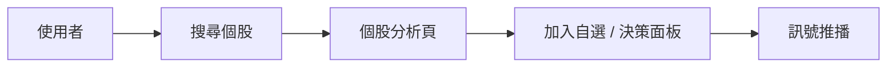

# 網站開發規格書範本

> 用法：複製本檔 → 把 `〈方括號〉` 佔位內容換成你的專案。
> 撰寫順序採「由下而上」：先逐個模組，再組合成子系統，最後描述整體。
> 本檔以 **finlab-stock-analyzer（單一個股深度分析平台）** 為已填寫範例，方便對照。

---

## 0. 專案資訊

| 項目 | 內容 |
|---|---|
| 專案名稱 | 〈finlab-stock-analyzer〉 |
| 一句話定位 | 〈對單一台股做機構級深度分析的 Web App〉 |
| 對標產品 | 〈FinLab 的分析模式〉 |
| 線上網址 | 〈https://finlab-app.zeabur.app〉 |
| GitHub Repo | 〈frank000210/finlab-stock-analyzer〉 |
| 文案語系 | 〈繁體中文〉 |

### 0.1 決策紀錄（需求澄清的答案）

| 決策 | 選擇 | 理由 |
|---|---|---|
| 前端技術 | 〈HTML/JS（Vue 3）〉 | 〈專業、靈活、可長期演進〉 |
| 分析對象 | 〈單一目標深度分析〉 | 〈取代舊版批次多檔模式〉 |
| 保留功能 | 〈MOPS 財報爬蟲 / LINE 通知 / ML 預測：保留〉 | — |
| Repo 策略 | 〈新建 repo〉 | — |
| 部署平台 | 〈Zeabur（已有帳號）〉 | — |

---

## 1. 技術棧

| 層 | 技術 |
|---|---|
| 前端 | 〈Vue 3 + Vite + Pinia + Vue Router + TradingView Lightweight Charts〉 |
| 後端 | 〈Python 3.11 + FastAPI + uvicorn〉 |
| 分析 | 〈TA-Lib、pandas、scikit-learn〉 |
| 資料來源 | 〈FinMind、TWSE、TDCC open data、MOPS〉 |
| 快取 | 〈記憶體 / 檔案快取，key 帶版本如 `chip_analysis:v5:`〉 |
| 部署 | 〈Zeabur，單一 Docker 映像（前端 build + 後端服務同源）〉 |
| 同源策略 | 〈前端 `API_BASE=''`，FastAPI 同時服務 SPA 與 `/api`〉 |

---

## 2. 程式 / 模組規格（由下而上）

> 每個模組用以下小節描述：**輸入 → 處理 → 輸出 → 對外端點（如有）**。

### 2.1 爬蟲層（範例）

| 模組 | 功能 | 輸入 | 輸出 |
|---|---|---|---|
| 〈price_crawler〉 | 〈抓日 K 線〉 | 〈symbol, 起迄日〉 | 〈OHLCV 序列〉 |
| 〈chip_crawler〉 | 〈抓三大法人 / 集保分級〉 | 〈symbol〉 | 〈法人買賣超、持股分佈〉 |
| 〈mops_crawler〉 | 〈抓財報〉 | 〈symbol, 季別〉 | 〈財報指標〉 |

### 2.2 分析層（範例）

| 模組 | 功能 | 重點 |
|---|---|---|
| 〈technical〉 | 〈20+ 技術指標〉 | 〈MA/RSI/MACD/DMI…〉 |
| 〈chip_health〉 | 〈籌碼健診 6 面向加權評分 0-100〉 | 〈集保/法人/同步/主力成本/維持率/投機〉 |
| 〈major_cost〉 | 〈主力成本線估算〉 | 〈成本、乖離、研判〉 |
| 〈backtest〉 | 〈策略回測〉 | 〈報酬、MDD、勝率〉 |
| 〈ml_predict〉 | 〈漲跌預測〉 | 〈RandomForest / LSTM〉 |

### 2.3 API 層（範例端點）

| 方法 | 路徑 | 回傳 |
|---|---|---|
| GET | 〈/api/v1/stocks/{symbol}/info〉 | 〈基本資料〉 |
| GET | 〈/api/v1/stocks/{symbol}/price〉 | 〈K 線〉 |
| GET | 〈/api/v1/stocks/{symbol}/chip-score〉 | 〈籌碼健診 {score,tone,verdict,factors}〉 |
| GET | 〈/api/v1/stocks/{symbol}/major-cost〉 | 〈主力成本〉 |

> API 回傳統一格式：`{ "success": true, "data": ... }`。

### 2.4 前端層（範例頁面）

| 頁面 | 路徑 | 功能 |
|---|---|---|
| 〈首頁〉 | 〈/〉 | 〈搜尋、特色導覽、最近瀏覽〉 |
| 〈個股分析〉 | 〈/stocks/:symbol〉 | 〈K線+指標+籌碼+決策〉 |
| 〈決策面板〉 | 〈/decision〉 | 〈自選股逐卡訊號+籌碼健診徽章〉 |
| 〈籌碼分析〉 | 〈/chip〉 | 〈主力/散戶/大戶進出〉 |
| 〈回測〉 | 〈/backtest〉 | 〈策略歷史驗證〉 |
| 〈後台〉 | 〈/admin〉 | 〈設定 CRUD、log、通知（需登入）〉 |

---

## 3. 整體系統功能（往上組合）

用一段文字描述系統如何串起來，例如：
> 使用者輸入股票代碼 → 後端整合〈技術 / 基本 / 籌碼〉三維資料 → 分析層產生〈加權評分與買賣建議〉→ 前端以〈K 線疊圖、籌碼健診卡、決策徽章〉呈現 → 重要訊號可經〈LINE/Telegram〉推播。

### 3.1 核心使用者流程

---

## 4. 重構 / 新版目標

| 項目 | 舊版 | 新版 |
|---|---|---|
| 分析導向 | 〈批次多檔〉 | 〈單一個股深度〉 |
| 分析模式 | 〈規則型批次〉 | 〈對標 FinLab 的研究流程〉 |
| 前端 | 〈無/簡易〉 | 〈Vue 專業 SPA + 圖表〉 |

---

## 5. 非功能需求

- **效能**：重運算結果快取（key 帶版本號），冷啟動可接受、之後命中快取。
- **RWD**：桌機 / 平板 / 手機三段式版面。
- **可及性**：內文對比 ≥ 4.5:1；觸控目標 ≥ 24px；尊重 `prefers-reduced-motion`。
- **動效**：進場動效須「內容預設可見 + failsafe」，不可因動畫沒觸發而留白。
- **安全**：祕密不入庫；後台功能需 Google 登入且帳號白名單可設定。

---

## 6. 部署規格 ⚠️

- **建置來源**：repo 根目錄 `Dockerfile`（多階段：前端 vite build → 後端 FastAPI 服務 dist + `/api`）。
- **部署指令**：一律從 **repo 根目錄**執行 `zeabur deploy`（詳見 `00-開發流程.md` 第八節）。
- **驗收**：`/` 回 200 且 index hash 變更；`/api/v1/<probe>` 的 `Content-Type` 為 `application/json`。

---

## 7. 驗收清單

- [ ] 規格內所有頁面 / 端點皆可運作
- [ ] 全站文案語系正確
- [ ] RWD 三斷點正常
- [ ] 線上 `/api` 回 JSON（後端連通）
- [ ] 核心使用者流程可走通
