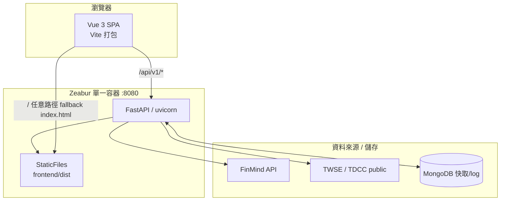
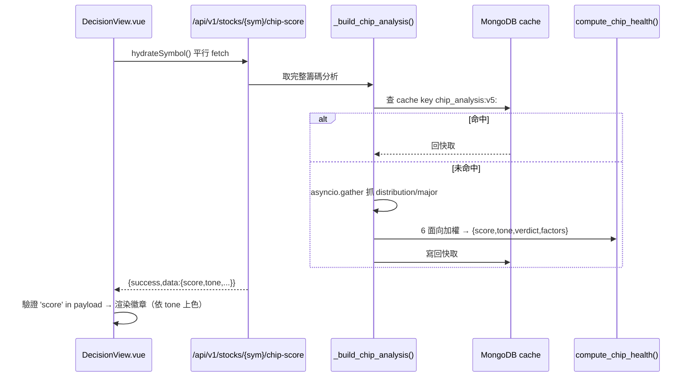

# 技術架構文件（前後端）

> 本文件描述 **finlab-stock-analyzer** 實際的前後端技術架構，依據現有原始碼撰寫。
> 配套：`00-開發流程.md`、`01-規格書範本.md`、`02-AI提示詞範本.md`、`04-開發指引.md`。

---

## 一、系統總覽

採「**單一 Docker 映像、同源前後端**」架構：FastAPI 同時提供 `/api/*` 與 SPA 靜態檔，
因此前端 `API_BASE=''`（同源呼叫），部署單純、無 CORS 問題。



**請求路由規則**（見 `backend/app/main.py`）：
- `/api/*` → 各 APIRouter。
- 其餘任意路徑 → `serve_spa()`：命中實體檔回該檔，否則回 `index.html`（支援前端 history 路由）。

---

## 二、後端架構（FastAPI / Python 3.11）

### 2.1 分層

```
backend/app/
├── main.py            # 應用組裝：CORS、SafeJSONResponse、掛載 20+ router、SPA fallback、health
├── config/settings.py # pydantic-settings，讀 .env（FinMind token、Google OAuth、Mongo URI…）
├── api/               # 路由層（薄）：每個檔一個 APIRouter，prefix=/api/v1/...
├── analysis/          # 分析層：technical、chip_*、major_players、day_trade、seasonal、lead_lag…
├── backtest/          # 回測引擎 + 4 種策略（ma_crossover/rsi/macd/bollinger）
├── crawler/           # 資料抓取：finmind_client、stock_price、institutional、fundamental、twse_public
├── ml/                # predictor（scikit-learn）
├── news_checker/      # 新聞可信度分析
├── signal_rules/      # 規則型訊號引擎
├── ai_agent/          # 訊號產生器
├── risk/ trade/ notify/  # 風控、下單審批、LINE/Telegram 推播
└── db/                # cache（MongoDB）、cached 裝飾器、mongodb 連線
```

**設計原則**：`api/` 層只做參數驗證與組裝；真正運算在 `analysis/` `backtest/` 等層。
同一份重運算結果可被「完整端點」與「輕量端點」共用（例：`chip.py` 的 `_build_chip_analysis()`
同時餵給 `/{symbol}/chip`（完整）與 `/{symbol}/chip-score`（輕量徽章））。

### 2.2 關鍵機制

| 機制 | 位置 | 說明 |
|---|---|---|
| 安全 JSON | `main.py:SafeJSONResponse` | 把 NaN/Inf→0、numpy 型別→原生型別，避免前端解析爆掉 |
| 設定管理 | `config/settings.py` | `@lru_cache` 單例；所有祕密走環境變數 |
| 快取 | `db/cache.py` + `db/cached.py` | MongoDB 後端；cache key **帶版本**（如 `chip_analysis:v5:`）→ 改演算法時 bump 版號即失效 |
| 並行抓取 | 各 api | `asyncio.gather(..., return_exceptions=True)` 平行抓多來源、單點失敗不拖垮整體 |
| 啟動索引 | `main.py:startup_db` | 建 pageviews / user_logs 索引；Mongo 不可用時降級略過 |
| 健康檢查 | `GET /api/health` | 回 `{status, version, routes}` |

### 2.3 統一回傳格式

```json
{ "success": true, "data": { ... } }
```
> 前端 `apiGet` 會解 `payload.data ?? payload`；當 data 為 null 會 fallback 到外層，
> 因此使用前要**驗證形狀**（如 `'score' in payload`）再取值。

### 2.4 主要相依（`backend/requirements.txt`）

`fastapi` `uvicorn[standard]` `pydantic(-settings)` `httpx` `pandas` `numpy`
`yfinance` `scikit-learn` `motor`/`pymongo`(MongoDB async) `google-auth` `PyJWT`。
原生編譯相依 **TA-Lib** 於 Dockerfile 內由原始碼編譯。

---

## 三、前端架構（Vue 3 + Vite）

### 3.1 結構

```
frontend/src/
├── main.js            # createApp + Pinia + Router + 全域指令 v-reveal + mount
├── router.js          # 路由表，所有 view 皆 () => import() 懶載入（每頁獨立 chunk）
├── App.vue            # 外殼：導覽、全域搜尋、PageCounter
├── assets/main.css    # 設計 token（:root 變數）+ 全域樣式 + 動效/RWD/可及性
├── stores/            # Pinia：stock（當前個股，存 localStorage）、auth（Google 登入）
├── components/        # 共用元件，如 PageCounter
├── directives/reveal.js # v-reveal 進場動效指令（IntersectionObserver + failsafe）
└── views/             # 各頁面（Home/Analysis/Decision/Chip/Backtest/Admin…）
```

### 3.2 關鍵慣例

| 主題 | 慣例 |
|---|---|
| API base | 各 view 內 `const API_BASE = location.hostname==='localhost' ? 'http://localhost:8000' : ''`（正式同源） |
| 取數 | 自帶 `apiGet(path)`（fetch + `response.json()`），回 `payload.data ?? payload` |
| 圖表 | `lightweight-charts`（K 線、疊圖：收盤 + 法人累積 + 主力成本線） |
| 狀態 | Pinia；`stockStore.setStock(sym, name)`，`symbol/name` 為唯讀 computed |
| 路由 | history 模式；個股相關頁用 `/stocks/:symbol/...` |
| 懶載入 | 每個 view 動態 import → 各自 chunk，首屏只載 index + 該頁 |
| 設計 token | 一律用 `assets/main.css` 的 CSS 變數（`--bg-card`、`--accent-blue`、`--color-up/down`…） |

### 3.3 設計系統（深色金融主題）

- 字體：Inter（內文）+ JetBrains Mono（數字，`font-variant-numeric: tabular-nums`）。
- 色彩語意：漲 `--color-up`（綠）、跌 `--color-down`（紅）、警示 `--color-warning`。
- 動效：`v-reveal` 進場（內容預設可見 + 1.4s failsafe + `prefers-reduced-motion` 後備）。
- 可及性：內文對比 ≥ 4.5:1、觸控目標 ≥ 24px、RWD 三斷點。

---

## 四、資料流（以「籌碼健診徽章」為例）



---

## 五、部署架構（Zeabur）

- **建置**：repo 根 `Dockerfile` 多階段——
  1. `node:20-alpine` 跑 `npm install && npm run build` → `frontend/dist`
  2. `python:3.11-slim` 編譯 TA-Lib、`pip install`、複製 backend + 前端 dist
  3. `CMD uvicorn app.main:app --host 0.0.0.0 --port 8080`
- **同源**：FastAPI 服務 `/api` 與 SPA，故前端 `API_BASE=''`。
- **環境變數**：`FINMIND_TOKEN`、`GOOGLE_CLIENT_ID`、`MONGODB_URI`、`LINE_NOTIFY_TOKEN`、
  `TELEGRAM_*`、`CORS_ORIGINS` 等於 Zeabur 服務設定，不入庫。

> 部署與驗證細節見 `00-開發流程.md` 第八、九節。

---

## 六、架構決策摘要（ADR 精簡版）

| 決策 | 選擇 | 理由 |
|---|---|---|
| 前後端同源單容器 | 是 | 部署簡單、無 CORS、`API_BASE=''` |
| 前端框架 | Vue 3 + Vite | 專業 SPA、懶載入、生態成熟 |
| 圖表庫 | lightweight-charts | 金融 K 線專用、輕量高效 |
| 快取後端 | MongoDB + 版本化 key | 重運算結果可控失效 |
| 回傳容錯 | SafeJSONResponse | 金融資料常有 NaN/numpy，避免前端崩 |
| 分析/路由分層 | 是 | router 薄、運算可複用於多端點 |
