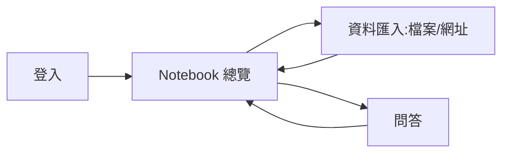

# 知識庫網頁規格書

> 讓 Frank 可以透過網頁對 `knowledge_base`（現行 `F:\knowledge_base` 的 MongoDB + Python CLI）做資料匯入與 AI 問答，仿照 NotebookLM 的使用體驗。部署後遷移到 Zeabur 雲端，脫離只能本機操作的限制。

---

## 0. 專案資訊

| 項目 | 內容 |
|---|---|
| 專案名稱 | 知識庫網頁（暫名 `kb-web`） |
| 一句話定位 | 讓知識庫（patent / finlab / 未來更多領域）可以透過網頁匯入資料、並用 AI 問答查詢 |
| 對標產品 | NotebookLM（來源匯入 + 有引用的對話式問答） |
| GitHub Repo | 沿用 `finlab-stock-analyzer`（新增子目錄，不另開 repo） |
| 部署平台 | Zeabur（沿用現有帳號，同專案下新增一個服務） |
| 文案語系 | 繁體中文 |

### 0.1 決策紀錄（需求澄清的答案）

| 決策 | 選擇 | 理由 |
|---|---|---|
| 使用範圍 | 部署到 Zeabur，非僅本機 | 使用者明確要求可從網頁操作、可分享 |
| 資料庫 | 在既有 Zeabur MongoDB（`172.234.90.16:30302`）新建 `knowledge_base` 資料庫 | 已確認該 Mongo 上原本沒有知識庫資料，沿用同一台伺服器不用多開資源 |
| 前端技術 | Vue 3（跟 finlab-stock-analyzer 一致） | 與現有 repo 技術棧一致，降低維護成本 |
| 後端技術 | FastAPI，直接 import 現有 `knowledge_base` Python 套件 | 重用既有 ingest/query 邏輯，不用重寫 |
| Repo / 部署結構 | 併入 `finlab-stock-analyzer` repo，但作為**獨立的新 Zeabur 服務**（新 service-id） | 使用者指定併入同一 repo；獨立服務避免跟主站的 build 流程互相干擾 |
| 問答功能 | 真正對話式回答（非僅回傳片段） | 使用者要求要像 NotebookLM，答案需由 LLM 根據檢索片段生成 |
| LLM API | Claude API，金鑰由使用者於 Zeabur 服務環境變數 `ANTHROPIC_API_KEY` 設定 | 使用者已有金鑰（在別的 session），不經過本對話取得或存放 |
| 資料匯入範圍（v1） | 檔案上傳（.docx/.pptx/.pdf/.md/.txt）＋ 網址匯入 | 使用者要求兩者一起做；`.doc`/`.ppt` 舊格式不在網頁支援範圍（見 §5） |
| 存取保護 | 單一共用密碼登入（無帳號系統） | 內容含專利分析等機密資料，部署後有公開網址，需要基本防護 |
| CLI / AI 工具存取 | 另加一組獨立 API token（`Authorization: Bearer`），與網頁密碼分開 | Claude Code、GitHub Copilot CLI 等工具無法走瀏覽器登入流程；用 token 讓 CLI 工具能直接呼叫 REST API，且與人類密碼權限分離、可個別撤銷 |

---

## 1. 技術棧

| 層 | 技術 |
|---|---|
| 前端 | Vue 3 + Vite（沿用 `finlab-stock-analyzer/frontend` 的建置慣例） |
| 後端 | Python 3.11+ + FastAPI + uvicorn |
| 知識庫核心邏輯 | 現有 `knowledge_base` 套件（`spec_ingest.py`、`query.py`、`semantic_search.py` 等），以 Python 模組直接 import，不透過 shell 呼叫 CLI |
| 網頁抓取 | `requests` + `trafilatura`（新增依賴，僅供網址匯入使用） |
| 問答生成 | Claude API（`anthropic` Python SDK） |
| 資料庫 | 既有 Zeabur MongoDB，新建 `knowledge_base` 資料庫 |
| 認證 | 雙軌：瀏覽器走單一密碼比對 + HttpOnly session cookie；CLI/AI 工具走 `Authorization: Bearer <KB_API_TOKEN>`，不做帳號系統 |
| 部署 | Zeabur，單一 Docker 映像（前端 build + 後端服務同源，`/api/*` 走 FastAPI，其餘回傳 SPA） |

---

## 2. 程式 / 模組規格

### 2.1 後端 API 層

| 方法 | 路徑 | 功能 | 輸入 | 輸出 |
|---|---|---|---|---|
| POST | `/api/login` | 密碼登入 | `{password}` | 設定 session cookie |
| POST | `/api/logout` | 登出 | — | 清除 cookie |
| GET | `/api/notebooks` | 列出所有 domain（notebook）總覽 | — | `[{domain, doc_count, last_updated, quality_failed, needs_review}]` |
| POST | `/api/import/file` | 上傳檔案匯入 | multipart：檔案 + `domain` | `{imported, skipped, failed, quality_failed, doc_ids}` |
| POST | `/api/import/url` | 網址匯入 | `{url, domain}` | 同上（單筆） |
| POST | `/api/ask` | 問答 | `{question, domain?}` | `{answer, citations:[{title, source_path|source_url}]}` |

> 所有 `/api/*`（除 `/api/login`）皆需驗證，接受兩種方式其一：瀏覽器 session cookie，或 `Authorization: Bearer <KB_API_TOKEN>`（給 CLI/AI 工具用）。兩者皆無則回 401。

### 2.1.1 CLI / AI 工具使用方式

Claude Code、GitHub Copilot CLI 等能執行 shell 指令的工具，可直接用 `curl` 呼叫 `/api/ask`，不需要瀏覽器登入、不需要知道 MongoDB 連線字串：

```bash
curl -X POST https://<部署網址>/api/ask \
  -H "Authorization: Bearer $KB_API_TOKEN" \
  -H "Content-Type: application/json" \
  -d '{"question":"上位語下位語怎麼判斷","domain":"patent"}'
```

`KB_API_TOKEN` 由使用者自行保管於本機環境變數，不寫進程式碼或對話中。repo 內會附一份簡短的使用說明（README 或 `CLAUDE.md` 補充段落），讓 Claude Code 依現有 OpenWiki 慣例，在處理特定領域任務時主動查詢此知識庫。

### 2.2 匯入層（重用既有邏輯）

| 模組 | 功能 | 備註 |
|---|---|---|
| `import_file` | 呼叫既有 `spec_ingest` 邏輯處理單一上傳檔 | 限定副檔名 `.docx/.pptx/.pdf/.md/.txt`；`.doc/.ppt` 直接回錯誤訊息，提示改用本機 CLI |
| `import_url` | `requests` 抓取 → `trafilatura` 抽正文 → 存成 markdown（含 `source_url` metadata）→ 走同一條 ingest 邏輯 | 抓取失敗或正文過短（可能是 JS 動態頁面）時回警告訊息 |
| 匯入後處理 | 對新匯入的文件做增量語意索引（非整庫 `--force` 重跑） | 沿用 `semantic_search.py`，新增單筆索引路徑 |

### 2.3 問答層

| 步驟 | 說明 |
|---|---|
| 1. 檢索 | 用既有 `semantic_search` 依 `domain`（可選）取回相關片段（title + content + source） |
| 2. 組 prompt | 系統訊息帶入檢索片段（含來源標記），使用者問題原樣附上 |
| 3. 呼叫 Claude API | 用環境變數 `ANTHROPIC_API_KEY`；失敗/超時回傳明確錯誤，不讓前端卡住 |
| 4. 回傳 | 答案文字 + 引用來源清單（本機檔名或原始網址） |

### 2.4 前端頁面

| 頁面 | 路徑 | 功能 |
|---|---|---|
| 登入 | `/login` | 輸入密碼 |
| Notebook 總覽 | `/` | 列出各 domain 的資料筆數、最後更新時間，可切換/新增 domain |
| 資料匯入 | `/import` | 拖放上傳檔案 / 貼網址，選擇目標 domain，顯示匯入結果 |
| 問答 | `/ask` | 對話框輸入問題，選擇 domain 範圍，顯示答案與可點擊的引用來源 |

---

## 3. 整體系統功能

使用者登入後，先在「Notebook 總覽」看目前有哪些領域知識、各有多少篇；到「資料匯入」頁拖檔案或貼網址把新資料加進指定 domain；到「問答」頁針對某個 domain（或全部）提問，後端檢索相關片段餵給 Claude API，生成有引用來源的答案。



---

## 4. 已知限制（v1 範圍界定）

- 網頁**不支援** `.doc`/`.ppt` 舊格式上傳（需要 LibreOffice 轉檔，不適合放進部署用的 Docker image）；這類檔案沿用本機 `_staging` 腳本 + CLI 匯入的既有流程。
- 網址匯入僅能抓**靜態/伺服器端渲染**頁面，無法處理需要 JavaScript 才會顯示內容的網站（沒有內建瀏覽器）。
- 不支援帳號分權，只有一組共用密碼，適合單人或小範圍分享使用。

---

## 5. 非功能需求

- **安全**：密碼、`ANTHROPIC_API_KEY`、MongoDB 連線字串一律走環境變數，不寫死在程式碼、不入庫；登入失敗需有基本延遲防暴力破解。
- **效能**：語意檢索沿用現有 bag-of-words hash 向量機制，資料量在千篇等級內即可接受；不特別做快取。
- **RWD**：桌機為主，手機/平板可用即可，不用像 finlab 主站三段式精修。
- **資料一致性**：匯入採內容 hash 當唯一鍵（沿用既有 `doc_id` 機制），重複匯入同一檔案不會產生重複資料。

---

## 6. 部署規格 ⚠️

- **目錄結構**：於 repo 根目錄新增獨立子目錄（例如 `kb-web/`，含自己的 `Dockerfile`、`frontend/`、`backend/`），與現有 `frontend/`（finlab 主站）互不干擾。
- **Zeabur 服務**：在既有 `finlab-stock-analyzer` 專案下**新增一個服務**（新 service-id），建置根目錄指向 `kb-web/`，避免和主站共用 service-id 導致 build 互相覆蓋。
- **環境變數**（於 Zeabur 服務設定，不經本對話）：`MONGODB_URI`、`ANTHROPIC_API_KEY`、`KB_WEB_PASSWORD`、`KB_API_TOKEN`。
- **部署指令**：比照 `docs/00-開發流程.md` 第八節既有慣例，從 `kb-web/` 對應的 service-id 部署，確認 build 走 Docker（非誤判為 static）。
- **驗收**：`/` 回 200；`/api/notebooks`（需登入）回 `application/json`；資料庫遷移後既有 55 筆資料（6 finlab + 49 patent）可在 Notebook 總覽看到。

---

## 7. 驗收清單

- [ ] 登入 / 登出可正常運作，密碼錯誤有適當提示且不洩漏細節
- [ ] Notebook 總覽正確顯示各 domain 篇數與更新時間
- [ ] 上傳 .docx/.pdf/.pptx 可成功匯入並在總覽看到筆數增加
- [ ] 上傳 .doc/.ppt 會得到清楚的「請改用本機 CLI」提示，而非隱晦失敗
- [ ] 貼網址可成功抓取正文並匯入；動態網站/抓取失敗有清楚錯誤訊息
- [ ] 問答功能能根據指定 domain 給出有引用來源的答案，來源可點擊追溯
- [ ] 本機既有 55 筆資料已遷移到 Zeabur 的 `knowledge_base` 資料庫且可查詢
- [ ] 用 `curl` + `Authorization: Bearer $KB_API_TOKEN` 可成功呼叫 `/api/ask` 取得答案，驗證 CLI/AI 工具可用路徑
- [ ] 部署驗收條件（首頁 200、`/api` 回 JSON、瀏覽器 MCP 實測無 console 錯誤）全部通過
